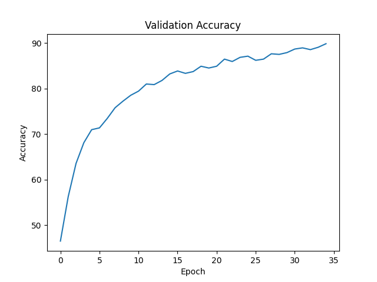
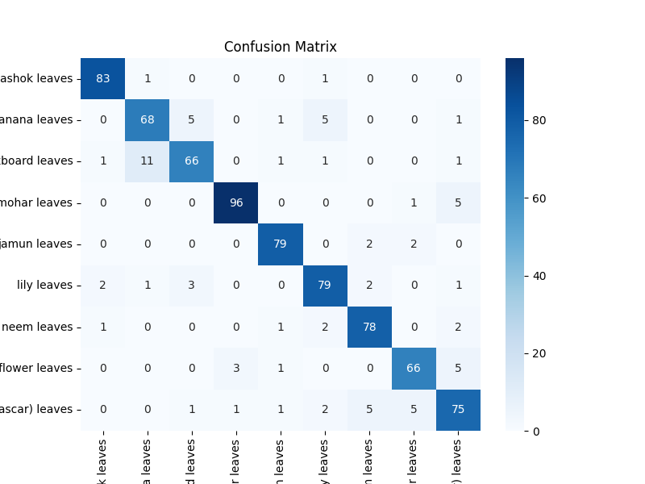

#  Leaf Classification using Self-Supervised Learning (SimCLR)

##  Overview

This project builds a **leaf classification system** using **Self-Supervised Learning (SimCLR)** followed by supervised fine-tuning.

The model first learns visual representations without labels and then performs classification across multiple plant species.

---

##  Key Features

*  Self-Supervised Learning (SimCLR)
*  Transfer Learning + Fine-Tuning
*  Custom CNN Encoder
*  Strong Data Augmentation
*  Confusion Matrix & Accuracy Analysis
*  Streamlit Web App for Predictions

---

##  Project Structure

```plaintext id="m8t7jm"
Leaf-Classification-ML/
│
├── dataset/            # Dataset
├── src/
│   ├── nn_pretrain.py  # SimCLR pretraining
│   ├── rest.py         # Training + evaluation
│   ├── predict.py      # Prediction script
│   └── app.py          # Streamlit app
│
├── models/             # Model files (excluded)
│   └── README.md
│
├── requirements.txt
└── README.md
```

---

##  Methodology

###  1. Self-Supervised Pretraining (SimCLR)

* Contrastive learning using augmented image pairs
* Learns useful feature representations without labels
* Encoder + projection head architecture

---

###  2. Fine-Tuning for Classification

* Load pretrained encoder
* Add classifier head
* Freeze + partially unfreeze layers
* Train on labeled dataset

---

###  3. Prediction System

* Loads trained model
* Applies preprocessing
* Outputs predicted class

---

###  4. Web Application

* Built with Streamlit
* Upload image → Get prediction + confidence

---

##  Model Performance

###  Validation Accuracy




* Final Accuracy: **~90%**
* Smooth convergence over 35 epochs
* Stable performance after epoch ~20

---

###  Confusion Matrix



* Strong diagonal → high accuracy
* Minor confusion between visually similar leaves
* Good performance across all 9 classes

---

##  Classes

* Ashok Leaves
* Banana Leaves
* Blackboard Leaves
* Gulmohar Leaves
* Jamun Leaves
* Lily Leaves
* Neem Leaves
* Paper Flower Leaves
* Sadabahar (Madagascar) Leaves

---

##  How to Run

### 1️ Install dependencies

```bash id="2m7u5f"
pip install -r requirements.txt
```

---

### 2️ Run training

```bash id="b9eqi7"
python src/rest.py
```

---

### 3️ Run prediction

```bash id="5m8iqo"
python src/predict.py
```

---

### 4️ Run web app

```bash id="6c6nhy"
streamlit run src/app.py
```

---

##  Model Files

Due to GitHub size limitations, `.pth` files are not included.

To generate models:

```bash id="3k0b7k"
python src/nn_pretrain.py
python src/rest.py
```

---

##  Technologies Used

* Python
* PyTorch
* Torchvision
* Scikit-learn
* Matplotlib & Seaborn
* Streamlit

---

##  Key Insights

* Self-supervised learning improves feature extraction
* Fine-tuning boosts classification performance
* Data augmentation improves generalization
* Model achieves ~90% validation accuracy

---

##  Future Improvements

* Use ResNet / EfficientNet backbone
* Hyperparameter tuning
* Deploy model on cloud
* Add real-time camera prediction

---

##  Author

**Akash Badgoti**

